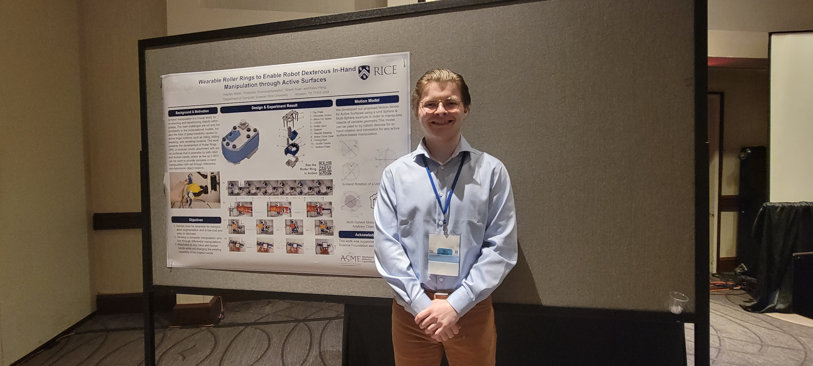

<!--StartFragment-->

We are excited to announce that our lab member, Hayden Webb, has placed 3rd place in the prestigious "Student Mechanism and Robotics Design Competition" at the 2024 ASME IDETC.

This is a very competitive competition where international teams from across the world apply to compete and showcase their engineering design projects. To apply, students submit a detailed report of their work showcasing its capabilities as well as highlighting their invention's ingenuity, novelty, and robustness in engineering. For this reason, students who apply for this competition are expected to have produced some robot or mechanism that excels in its purpose and goes beyond standard engineering designs.

From the initial applications, six finalists are selected and of these finalists, the top-ranked projects are awarded a travel grant to present their work in-person at the associated international ASME conference. Hayden was selected as a finalist and awarded a travel grant, exemplifying the work and exceptional level of engineering put into the project. 

Hayden placed 3rd in the undergraduate category in the final round of competition after giving both a talk and presentation on the Roller Ring. This award demonstrates the high-quality research and engineering design that is developed in our lab and showcases Hayden's extraordinary contribution to the field.  We congratulate Hayden on this hard-fought achievement and look forward to more of what comes next in his work!

## Video Presentation

Watch Hayden's presentation of the Roller Ring project:
[Watch the Roller Ring Presentation](https://drive.google.com/file/d/1J3lAjavMBV7FJxDEK0GsumOdJK12hqMm/view?usp=sharing)

<!--EndFragment-->