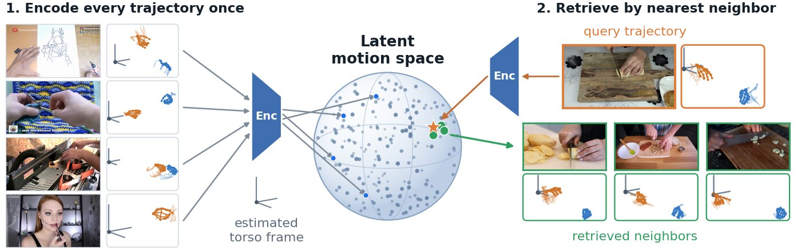

🔍 We are excited to introduce RoboTok, an internet-scale data engine that, given a query human manipulation video, retrieves manipulation-relevant human demonstrations from web videos for training dexterous robot policies.

Robot learning increasingly depends on broad and diverse demonstrations, but collecting robot data is expensive and covers the long tail of real-world tasks poorly. The internet already hosts an enormous amount of people manipulating objects with their hands. The difficulty is finding the clips that actually match the behavior you want to learn: the same manipulation can look completely different across camera viewpoints, scenes, and partially occluded actors.

RoboTok addresses this by learning a latent motion space from 3D hand trajectories expressed in estimated actor-centered reference frames. Because the trajectories are normalized to the actor rather than the camera, manipulation behaviors can be compared across viewpoint, appearance, and occlusion changes, and the representation stays compact enough for efficient search and continual indexing over internet-scale video collections.

What we care about most:

🧭 **Retrieval that follows the motion, not the pixels.** Encoding hand trajectories in an estimated torso frame makes matching robust to where the camera happened to be and what the kitchen happened to look like.

📈 **Better retrieval turns into better policies.** Compared against existing robot-data retrieval approaches, RoboTok retrieves more relevant manipulation demonstrations and improves downstream dexterous manipulation task success.

♾️ **A growing source of supervision.** Every trajectory is encoded once and indexed, so the corpus can keep expanding as more web video becomes available, making internet video a scalable and continuously growing source of supervision for robot learning.

Want to learn more about RoboTok? Check out the links below:

🌐 Project page: https://rice-robotpi-lab.github.io/RoboTok/  
📄 Paper: https://arxiv.org/abs/2609.03199  
💻 Code: https://github.com/Rice-RobotPI-Lab/RoboTok-Code  
📦 Data and models: https://huggingface.co/Rice-RobotPI-Lab/robotok-public
